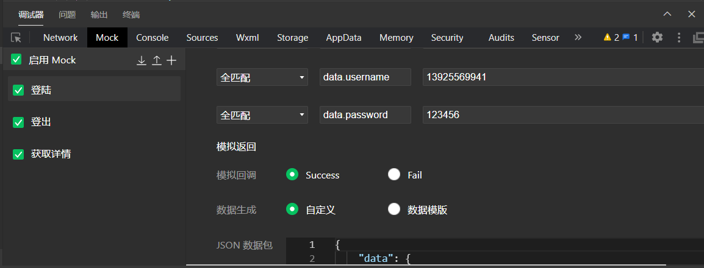
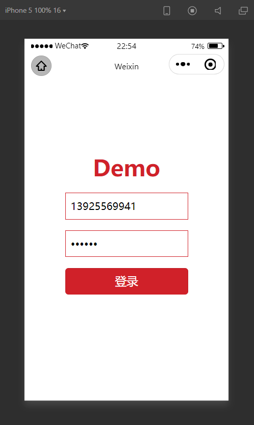
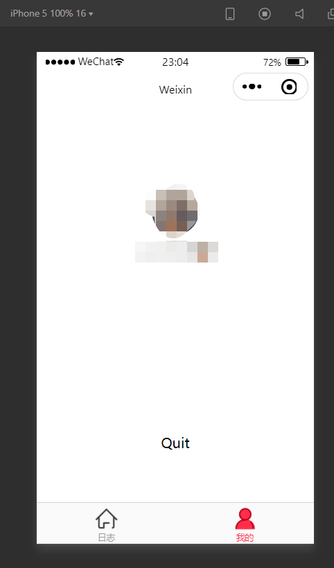

# 微信小程序原生框架

> 应公司要求使用原生开发，市面上小程序框架taro/wepy/mpvue等等都与我无缘，我开始网上寻找有没有哪位老哥封装了原生框架，几番下来确实有几个原生框架，但都封装的太简单，无法投入生产。于是便有了这个项目，既然没有，那就自己封装个。因为平时习惯用vue开发，所以这个原生框架是类似vue项目风格。
>
> 

##   工程目录

 ```
|- api 业务接口封装目录
|- components/top 自定义导航栏组件
|- icons 图标目录
|- pages 页面路径
|- store   小程序缓存等
|- utils   工程工具类  
|- app.js  工程入口
|- app.json  小程序原生配置
|- app.wxss  部分公共样式 
|- config.js     自定义配置类  
|- entry.js     程序入口,加载设备信息、网络信息、自定义配置
|- mock.config.json    mock数据  
|- package.json    项目包信息
|- project.config.json    小程序配置 
|- sitemap.json   站点配置 
 ```

## 运行项目

```
#下载项目
git clone https://github.com/Cloudintheking/mini-template 
#安装依赖包
npm i
```

接着微信开发者工具打开项目, `工具->构建npm`,此时会发现项目中多了`miniprogram_npm`目录,点击**普通编译**即可

打开`调试器->Mock->启用Mock` , 导入 [mock.config.json](mock.config.json)



输入用户账号/密码： 13925569941/123456





## 封装功能

### 1. store(状态管理)

#### 使用方法

假设存在页面index,那么index.js如下

```javascript
import {
  store
} from '/store/user.js'

import {
  bindStore,
  callPage
} from '/utils/filter'

callPage(bindStore(store,{
    //Page Options
}))
```

如果是组件,可参考[小程序的 MobX 绑定辅助库](https://developers.weixin.qq.com/miniprogram/dev/extended/utils/mobx.html)

**实现原理：**[filter.js](utils/filter.js)

### 2. computed、watch

**仅支持组件 [使用方法](https://developers.weixin.qq.com/miniprogram/dev/extended/utils/computed.html)**

### 3. mixin(混合)

**使用方法**

```js
import mixin from '/xxx/mixin' //自定义混合类
Page({
    mixins:[mixin]
})
```

**实现原理**: [mixins.js](utils/mixins.js)

### 4. 请求异步化

**使用方法：**

```
//api目录下新建,如登陆login.js
import {
    request,
    get,
    post
} from '/utils/request'

const USER_API = "/api/web/members/"

/**
 * 密码登陆
 * @param {*} data 
 * @returns 
 */
export function loginPass(data) {
    return post({
        url: USER_API + "login-password",
        data
    })
}
```

**实现原理：**[request.js](utils/request.js)  封装了[`miniprogram-api-promise`](https://developers.weixin.qq.com/miniprogram/dev/extended/utils/api-promise.html)

### 5. 表单验证

实现原理：[wxValidate.js](utils/wxValidate.js) 

使用方法:[WxValidate](https://github.com/wux-weapp/wx-extend/blob/master/docs/components/validate.md)

### 6. 登陆检查

**场景：**部分页面需要登陆才能访问

**使用方法：**

假设存在页面index,那么index.js如下

```js
import {
  checkLogin,
  callPage
} from '../../utils/filter'

callPage(checkLogin({
    //Page options
}))
```

**实现原理：**[filter.js](utils/filter.js)

### 7. UI

本框架ui使用**微信原生组件 + [vant  weapp](https://vant-contrib.gitee.io/vant-weapp/#/button)**

### 8. other

快下载项目吧，更多的功能等待你去发现